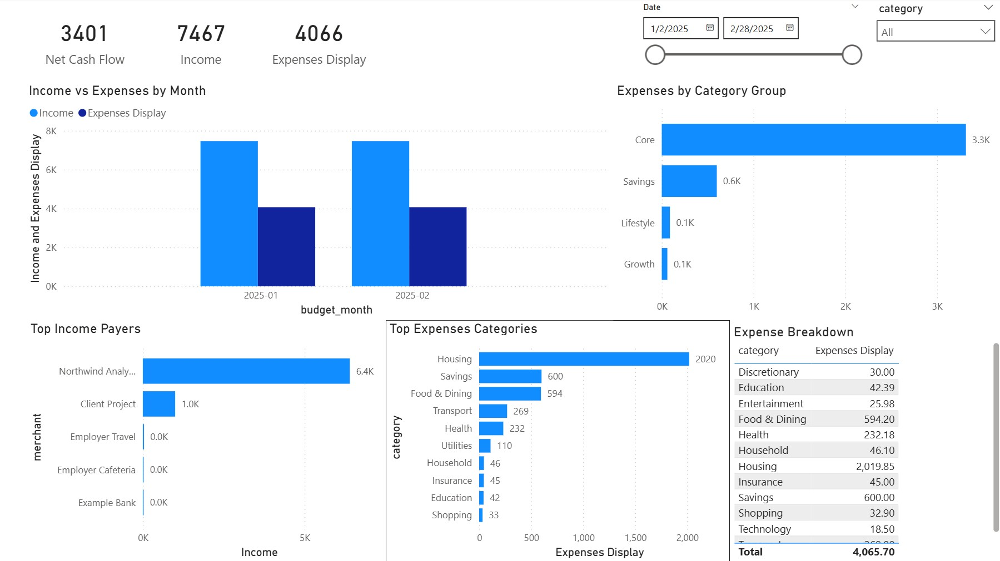
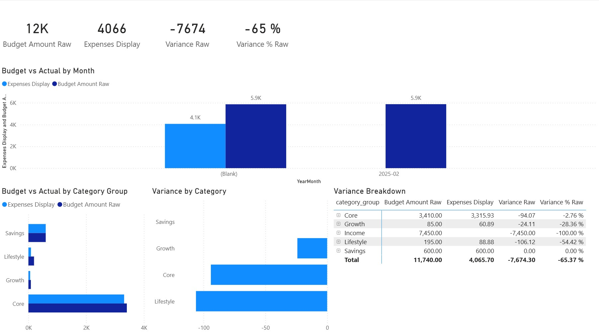

# Personal Finance Analytics

A portfolio project demonstrating an end to end analytics workflow for personal finance reporting, from raw transaction files to a structured Power BI dashboard.


## Project Summary

This project demonstrates how raw financial transaction exports can be transformed into a structured analytical model using a reproducible Python pipeline and a Power BI star schema.

Workflow:

Raw CSV exports  
→ Python ETL pipeline  
→ Rule based categorization  
→ Clean combined dataset  
→ Power BI star schema model  
→ Budget analytics dashboards

The project is presented as a public portfolio case study for data analytics and BI roles.

## Power BI Dashboard Preview


Example financial overview dashboard built on the processed transaction dataset.

## Analytics Workflow

This project demonstrates an end to end analytics pipeline:

Raw transaction exports  
↓  
Python ETL pipeline  
↓  
Rule based categorization  
↓  
Clean transaction dataset  
↓  
Power BI star schema model  
↓  
Budget analytics dashboards

## Project Scope

This repository presents a simplified but realistic analytics workflow for personal finance reporting.

Included in this project:

• synthetic transaction datasets  
• rule based categorization examples  
• Python data preparation pipeline  
• documentation of the analytical model  
• reproducible output datasets  
• Power BI modeling guidance  

The public repository intentionally excludes any real financial records or private source exports.

All examples are synthetic or sanitized to demonstrate the workflow without exposing personal data.

## Project Review Guide

If you are reviewing this repository, a good path is:

1. Review the analytics workflow described in the architecture documentation
2. Inspect the synthetic datasets in `data/sample/`
3. Review the rule-based categorization examples in `rules/`
4. Run the Python pipeline from `src/main.py`
5. Inspect the generated datasets and documented BI model

This reflects how the full analytics process moves from raw data to reporting.

## Key Features

- Python based transaction ingestion and standardization
- Rule based categorization workflow
- Recategorization support for continuous cleanup
- Star schema model for reporting
- Power BI dashboards for budget analysis and diagnostics
- Public safe documentation and synthetic example data

## Tech Stack

- Python
- Pandas
- CSV based ingestion
- Power BI
- DAX
- Dimensional modeling

## Quick Start

1. Install Python 3.10 or newer
2. Install dependencies with `pip install -r requirements.txt`
3. Run the pipeline with `python src/main.py`
4. Review generated outputs in the `output/` folder
5. Use the synthetic datasets and outputs to build the Power BI model

## Running the Pipeline

A minimal Python pipeline is included to demonstrate the data preparation workflow.

See:

`docs/run_pipeline.md`

## Data Privacy Notice

This public repository does **not** contain real personal financial data.

All public examples, screenshots, documentation, and sample datasets are either sanitized or synthetically generated. Real source exports, personal identifiers, bank references, counterparties, and transaction descriptions are excluded.

## Project Architecture

The analytics flow is structured as:

Raw CSV exports  
→ Data standardization  
→ Categorization rules  
→ Combined transactions dataset  
→ Star schema model  
→ Budget reporting dashboards

See `docs/architecture.md` for more detail.

For a visual overview of the workflow see:

`docs/architecture_diagram.md`

## Data Model

Core analytical tables:

- FactTransactions
- DimDate
- DimCategory
- Budget

The model follows star schema principles for clean and scalable reporting.

See `docs/data_model.md` for full details.

## Dashboard Pages

- Financial Overview
- Category Calibration
- Budget vs Actual
- Budget Diagnostics

Sanitized screenshots will be stored in the `screenshots/` folder.

## Example Output

Example analytics outputs produced by the pipeline and Power BI model.



## Analytics Layer

Measures are organized into the following groups:

### Current Context Budget Analysis
- Budget Amount Raw
- Variance Raw
- Variance % Raw

### Annual Budget Measures
- Budget Amount
- Variance
- Variance %
- Budget Consumed %
- Budget Remaining
- Budget Pace %

### YTD Diagnostics
- Expenses YTD
- Budget YTD Correct
- Variance YTD
- Variance YTD %
- Forecast Year End
- Forecast vs Budget %

## Repository Structure

```text
personal-finance-analytics/
├ README.md
├ .gitignore
├ LICENSE
├ requirements.txt
├ data/
│  └ sample/
├ docs/
├ output/
├ rules/
├ screenshots/
├ src/
└ tests/
```

## Reproducibility

The public version of the project is designed to be reproducible using synthetic sample data and example rule files.

See `docs/reproducibility.md` for setup steps.

## Portfolio Relevance

This project demonstrates:

- ETL design
- data cleaning
- rule based categorization
- dimensional modeling
- DAX measure design
- dashboard design
- documentation discipline
- privacy aware analytics delivery

## What This Project Demonstrates

This repository is designed to show practical analytics skills across the full workflow:

- ingestion of raw style CSV inputs
- transformation and standardization in Python
- rule based categorization design
- reproducible output generation
- dimensional modeling for BI
- Power BI ready semantic structure
- privacy safe public project delivery

## How to Review This Repository

A good review path for this project is:

1. Read the project summary and architecture documents
2. Inspect the synthetic sample datasets in `data/sample/`
3. Review the example categorization rules in `rules/`
4. Run the Python pipeline from `src/main.py`
5. Inspect the generated outputs and documented Power BI workflow

This mirrors how the full analytics process is structured from raw data to reporting.

## Skills Demonstrated

This project demonstrates practical experience with:

    • Python data pipelines using Pandas and CSV ingestion  
    • Rule based data categorization workflows  
    • Data cleaning and transformation  
    • Dimensional modeling using a star schema  
    • Power BI semantic modeling  
    • DAX measures for financial analytics  
    • Budget versus actual variance analysis  
    • Reproducible analytics workflows  
    • Privacy safe data publishing

## Future Improvements

Possible future enhancements:

- stronger rule engine logic
- automated validation checks
- parameterized ingestion paths
- cloud deployment version
- expanded forecasting diagnostics